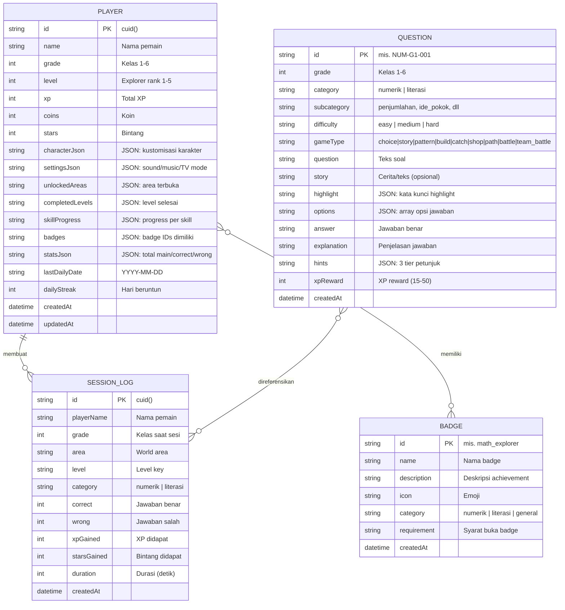
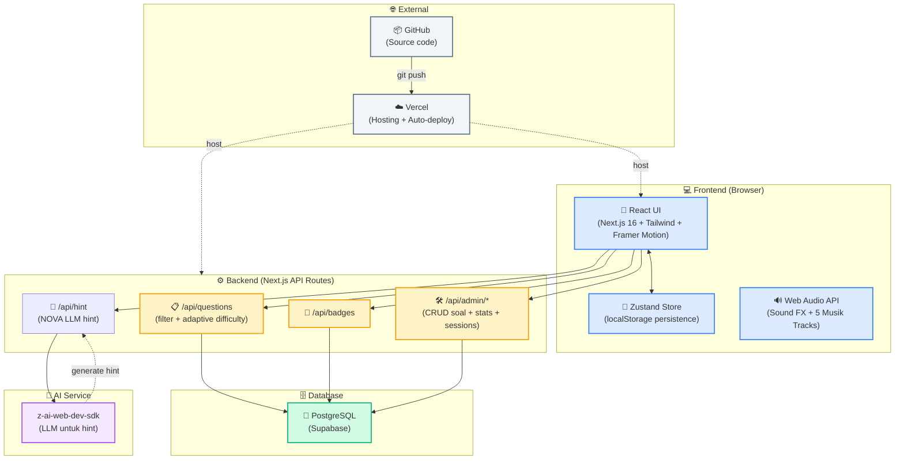

# 📊 Diagram NUSA LEARN

> File ini berisi diagram Use Case dan ERD untuk project NUSA LEARN.
> Diagrams ditulis dalam format Mermaid — GitHub akan auto-render visualnya.

---

## 1. Use Case Diagram

Diagram ini menunjukkan aktor (Siswa, Admin/Guru, Sistem AI NOVA) dan use case (fitur) yang bisa mereka lakukan di NUSA LEARN.

```mermaid
flowchart LR
    %% Actors
    Siswa(["🧒 Siswa SD<br/>(Kelas 1-6)"])
    Admin(["👨‍🏫 Admin / Guru<br/>/ Orang Tua"])
    NOVA(["🤖 Sistem AI<br/>(NOVA Robot)"])

    %% System boundary
    subgraph SYS["🎮 NUSA LEARN — Game Edukasi"]
        direction TB

        subgraph ONBOARDING["🎯 Onboarding & Setup"]
            UC1[("📋 Input Nama")]
            UC2[("🎓 Pilih Kelas")]
            UC3[("🎨 Kustomisasi Karakter")]
        end

        subgraph SOLO["🚀 Mode Single Player"]
            UC4[("🗺️ Jelajahi World Map")]
            UC5[("📖 Mainkan Level<br/>(9 mini-games)")]
            UC6[("🎯 Daily Challenge")]
            UC7[("📚 Practice Mode")]
            UC8[("🕹️ Arcade")]
        end

        subgraph MULTI["👥 Mode Multiplayer"]
            UC9[("👥 Setup Tim<br/>(2-4 tim)")]
            UC10[("🔄 Mode Bergiliran")]
            UC11[("⚡ Mode Siapa Cepat")]
            UC12[("⏱️ Timer Menjawab")]
        end

        subgraph MINIGAMES["🎮 9 Mini-Games Tersedia"]
            MG1[("❓ Choice Game")]
            MG2[("📖 Story Game")]
            MG3[("🔢 Pattern Game")]
            MG4[("🧩 Build Game<br/>(Susun Kalimat)")]
            MG5[("🎯 Catch Game<br/>(Tangkap Angka)")]
            MG6[("🛒 Shop Game<br/>(Belanja)")]
            MG7[("🚶 Path Game<br/>(Penjelajah Jalur)")]
            MG8[("⚔️ Battle Game<br/>(vs Robot)")]
            MG9[("🛡️ Team Battle<br/>(Tim vs AI)")]
        end

        subgraph PROGRESS["📈 Tracking & Reward"]
            UC13[("📈 Lihat Progress<br/>(My Learning Journey)")]
            UC14[("🏆 Lihat Rewards<br/>(Badge, Bintang, Koin)")]
            UC15[("👤 Edit Profile<br/>& Karakter")]
            UC16[("⚙️ Ubah Settings<br/>(Sound, Music, TV Mode)")]
            UC17[("💡 Minta Petunjuk<br/>dari NOVA")]
            UC18[("🏆 Dapatkan XP,<br/>Stars, Coins, Badges")]
        end

        subgraph ADMINFEAT["🛠️ Fitur Admin"]
            UC19[("🔐 Login Admin")]
            UC20[("📊 Dashboard Stats")]
            UC21[("📝 CRUD Soal<br/>(Tambah/Edit/Hapus)")]
            UC22[("🔍 Filter & Search Soal")]
            UC23[("📋 Lihat Sesi Belajar")]
            UC24[("👥 Lihat Pemain Terbaru")]
        end

        subgraph AIFEAT["🤖 Sistem AI (NOVA)"]
            UC25[("💡 Generate Hint<br/>(LLM-powered)")]
            UC26[("🧠 Adaptive Difficulty")]
            UC27[("😊 Feedback Positif<br/>(Tidak pernah 'SALAH!')")]
        end
    end

    %% Siswa associations
    Siswa --- UC1
    Siswa --- UC2
    Siswa --- UC3
    Siswa --- UC4
    Siswa --- UC5
    Siswa --- UC6
    Siswa --- UC7
    Siswa --- UC8
    Siswa --- UC9
    Siswa --- UC10
    Siswa --- UC11
    Siswa --- UC12
    Siswa --- UC13
    Siswa --- UC14
    Siswa --- UC15
    Siswa --- UC16
    Siswa --- UC17
    Siswa --- UC18

    %% Admin associations
    Admin --- UC19
    Admin --- UC20
    Admin --- UC21
    Admin --- UC22
    Admin --- UC23
    Admin --- UC24

    %% NOVA associations
    NOVA --- UC25
    NOVA --- UC26
    NOVA --- UC27

    %% include/extend relationships
    UC5 -.->|"includes"| MG1
    UC5 -.->|"includes"| MG2
    UC5 -.->|"includes"| MG3
    UC5 -.->|"includes"| MG4
    UC5 -.->|"includes"| MG5
    UC5 -.->|"includes"| MG6
    UC5 -.->|"includes"| MG7
    UC5 -.->|"includes"| MG8
    UC5 -.->|"includes"| MG9
    UC5 -.->|"extends"| UC17
    UC9 -.->|"includes"| UC10
    UC9 -.->|"includes"| UC11
    UC10 -.->|"includes"| UC12
    UC11 -.->|"includes"| UC12

    %% Styling
    classDef actor fill:#DBEAFE,stroke:#3B82F6,stroke-width:2px,color:#1E40AF
    classDef usecase fill:#F0F9FF,stroke:#0EA5E9,stroke-width:1.5px,color:#0C4A6E
    classDef adminUC fill:#FEF3C7,stroke:#F59E0B,stroke-width:1.5px,color:#78350F
    classDef aiUC fill:#F3E8FF,stroke:#A855F7,stroke-width:1.5px,color:#581C87
    classDef minigame fill:#F0FDF4,stroke:#10B981,stroke-width:1.5px,color:#064E3B

    class Siswa,Admin,NOVA actor
    class UC1,UC2,UC3,UC4,UC5,UC6,UC7,UC8,UC9,UC10,UC11,UC12,UC13,UC14,UC15,UC16,UC17,UC18 usecase
    class UC19,UC20,UC21,UC22,UC23,UC24 adminUC
    class UC25,UC26,UC27 aiUC
    class MG1,MG2,MG3,MG4,MG5,MG6,MG7,MG8,MG9 minigame
```

### Penjelasan Aktor

| Aktor | Deskripsi |
|------|-----------|
| 🧒 **Siswa SD** | Pemain utama (kelas 1-6). Berinteraksi dengan semua fitur game, mini-games, multiplayer, dan tracking. |
| 👨‍🏫 **Admin / Guru / Orang Tua** | Mengelola konten (CRUD soal) dan monitoring perkembangan siswa via dashboard. Login dengan password. |
| 🤖 **Sistem AI (NOVA)** | Robot pendamping yang memberikan hint adaptif (LLM-powered), mengatur tingkat kesulitan, dan feedback positif. |

### Penjelasan Use Cases Utama

| Kategori | Use Cases | Deskripsi |
|----------|-----------|-----------|
| **Onboarding** | Input Nama, Pilih Kelas, Kustomisasi Karakter | Setup awal pemain baru |
| **Single Player** | World Map, Main Level, Daily Challenge, Practice, Arcade | Mode petualangan solo |
| **Multiplayer** | Setup Tim, Bergiliran, Siapa Cepat, Timer | Main bareng teman di satu monitor |
| **9 Mini-Games** | Choice, Story, Pattern, Build, Catch, Shop, Path, Battle, Team Battle | Variasi gameplay |
| **Tracking** | Progress, Rewards, Profile, Settings, Minta Petunjuk, Dapatkan Reward | Manajemen pemain |
| **Admin** | Login, Dashboard, CRUD Soal, Filter, Lihat Sesi, Lihat Pemain | Pengelolaan konten |
| **AI (NOVA)** | Generate Hint, Adaptive Difficulty, Feedback Positif | Bantuan AI otomatis |

---

## 2. Entity Relationship Diagram (ERD)

Diagram ini menunjukkan struktur database NUSA LEARN (entitas, atribut, dan relasi).

### Penjelasan Entitas

#### 🧑 PLAYER
Menyimpan data pemain (satu row per pemain). Berisi:
- **Identitas**: `name`, `grade`, `level` (explorer rank)
- **Currency**: `xp`, `coins`, `stars`
- **Progress**: `unlockedAreas`, `completedLevels`, `skillProgress` (per subkategori)
- **Koleksi**: `badges` (JSON array badge IDs)
- **Kustomisasi**: `characterJson` (rambut, pakaian, aksesori)
- **Settings**: `settingsJson` (sound, music, TV mode, animasi)
- **Stats**: `statsJson` (total main, correct, wrong, streak)
- **Daily**: `lastDailyDate`, `dailyStreak` (untuk daily challenge streak)

#### 📝 QUESTION
Bank soal — bisa dikelola admin (CRUD). Berisi:
- **Klasifikasi**: `grade`, `category` (numerik/literasi), `subcategory`, `difficulty`
- **Game Type**: `gameType` (menentukan mini-game yang dipakai)
- **Konten**: `question`, `story` (untuk literasi), `highlight` (kata kunci)
- **Jawaban**: `options` (JSON array), `answer`, `explanation`
- **Hint**: `hints` (JSON 3-tier — dari umum ke spesifik, tidak pernah ungkap jawaban)
- **Reward**: `xpReward` (15-50 XP berdasarkan difficulty)

#### 🏆 BADGE
Definisi achievement (12 badge tersedia). Berisi:
- `id`, `name`, `description`, `icon` (emoji), `category`, `requirement`

#### 📋 SESSION_LOG
Log sesi belajar untuk analytics admin. Berisi:
- **Player ref**: `playerName`, `grade`
- **Session context**: `area`, `level`, `category`
- **Result**: `correct`, `wrong`, `xpGained`, `starsGained`, `duration`
- `createdAt` (timestamp)

### Relasi

| Dari | Ke | Tipe | Deskripsi |
|------|-----|------|-----------|
| PLAYER | SESSION_LOG | 1:N | Satu pemain bisa punya banyak sesi belajar |
| PLAYER | BADGE | M:N | Pemain dapat banyak badge (via JSON `badges` array) |
| QUESTION | SESSION_LOG | M:N | Soal direferensikan via `level`/`area` (tidak FK langsung) |

> **Catatan**: Relasi PLAYER-BADGE tidak pakai junction table — disimpan sebagai JSON array di field `badges` di PLAYER. Ini karena SQLite/PostgreSQL bisa simpan JSON. Untuk query badge pemain, parse JSON di aplikasi.

---

## 3. Diagram Arsitektur Sistem

Bonus: diagram arsitektur high-level NUSA LEARN.

---

## 📂 File Pendukung

| File | Fungsi |
|------|--------|
| `prisma/schema.prisma` | Skema database PostgreSQL (production) |
| `prisma/schema.sqlite.prisma` | Skema SQLite (dev lokal backup) |
| `prisma/seed.ts` | Script seed 574 soal + 12 badge |
| `src/store/gameStore.ts` | State management (Zustand) — player, session, view |
| `src/lib/nusa/world.ts` | Definisi 6 area + 28 level |
| `docs/DIAGRAMS.md` | File ini (diagram Mermaid) |
| `public/diagrams.html` | Halaman HTML untuk view diagram di browser |

---

## 🔍 Cara View Diagram

### Opsi 1: GitHub (Auto-render)
Buka file `docs/DIAGRAMS.md` di GitHub — diagram Mermaid akan auto-render visual.

### Opsi 2: Browser Lokal
Buka file `public/diagrams.html` di browser — diagram render via Mermaid.js CDN.

### Opsi 3: Mermaid Live Editor
Copy code block Mermaid ke https://mermaid.live untuk edit & export PNG/SVG.
